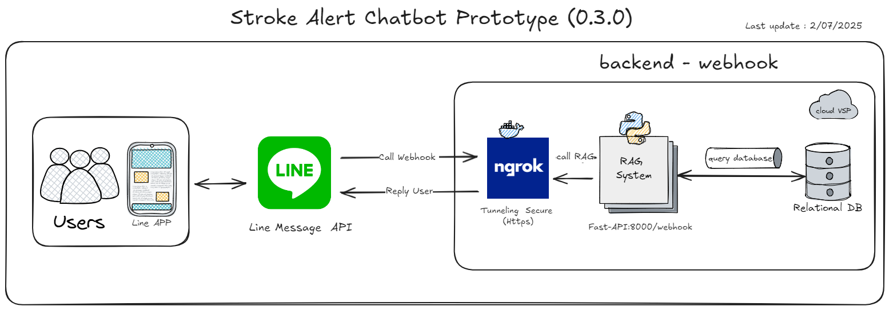

# Stroke Alert Chatbot Prototype



## Requirements  
- Python 
- Line Messaging API 
- (LLM) Openai API
- Fastapi
- Langchain 
- Docker 
- Ngrok 
- MySQL database 
- UV python package manager   

## Setup 
- clone repo
```bash  
https://github.com/JeerasakAnanta/strokeAlert.git
cd strokeAlert
```

### environment 

- install [uv](https://docs.astral.sh/uv/)  
```bash 
# linux and mac  
curl -LsSf https://astral.sh/uv/install.sh | sh
```

-  create  environment 
```bash
uv venv
source venv/bin/activate
``` 

- update  install package 
```bash
uv sync 
``` 
# run server chatbot
- run webhook server 
```bash
uv run webhook_sql_rag.py
```  
- webhook server will run on port 8000 by default.
http://you-ip:8000/webhook

- check database 
```bash 
uv run scripts/run_check_db_connection.py
``` 

##  setup  ngrok with docker  

-  install docker 
```bash
docker run --net=host -it -e NGROK_AUTHTOKEN="YOUR_NGROK_TOKEN" ngrok/ngrok:latest http 8000
```
-  ngrok will run on port 8000 by default.
-  https://YOUR_NGROK.ngrok-free.app

- create database 
```sql 
CREATE TABLE `ncdprototype` (
    `hn` VARCHAR(255) NOT NULL,
    `date` DATE NOT NULL,
    `full_name` VARCHAR(255),
    `address` TEXT,
    `bmi` FLOAT,
    `sbp` INT,
    `dbp` INT,
    `blood_sugar` FLOAT,
    `bone_status` VARCHAR(100),
    `dementia` TINYINT,
    `depression` TINYINT,
    `nutrition_status` VARCHAR(100),
    `smoking` TINYINT,
    `recorder` VARCHAR(100)
);

```
## 🗂️ Version History

| Version | Date       | Author      | Description     |
| ------- | ---------- | ----------- | --------------- |
| 0.1.0   | 02/06/2023 | Jeerasak A. | Initial release |
| 0.3.0   | 02/07/2023 | Jeerasak A. | change  server  |
